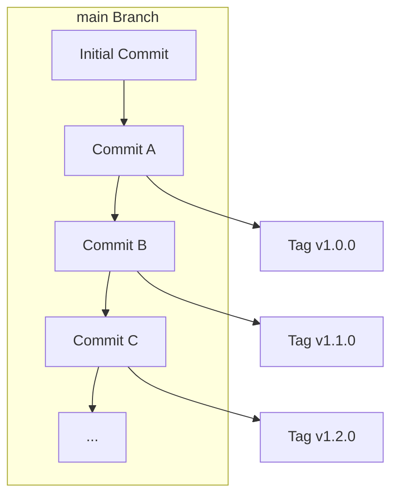

# release-typescript-action [](https://github.com/int128/release-typescript-action/actions/workflows/ts.yaml)

This is an action for releasing TypeScript-based GitHub Actions.

## Purpose

We need to add the generated files (e.g. `dist/index.js`) into a release tag because it runs on Node.js.
It causes the following problems:

- The release workflow is complex.
- A commit diff would be large because it contains the generated files.
- The commit history would grow.

This action solves these problems.
You don't need to commit the generated files into the main branch anymore.

This action creates a release tag with the generated files.
For example, a release tag (e.g. Tag v1.0.0) contains the generated files,
but `main` branch (e.g. Commit A, B and C) does not.



## Getting started

### Use-case: Continuous release flow

This workflow continuously creates a new release from `main` branch.

```yaml
name: release

on:
  pull_request:
    paths:
      # To test this workflow
      - .github/workflows/release.yaml
  push:
    branches:
      # When the branch is pushed, release a new version of action
      - main

jobs:
  tag:
    runs-on: ubuntu-latest
    steps:
      - uses: actions/checkout@v4
      - uses: actions/setup-node@v4
        with:
          node-version: 20
      - run: npm install -g pnpm@latest-10
      - run: pnpm i
      - run: pnpm build
      - uses: int128/release-typescript-action@v1
```

When you merge a pull request into `main` branch, this action will create a new release of new minor version.
For example, if the latest tag `v1.5.0` exists, this action will create a tag `v1.6.0`.
It will also update the major tag `v1` to track the latest tag.

See also https://github.com/int128/typescript-action.

### Use-case: Daily release flow

This workflow everyday creates a new release from `main` branch.

```yaml
name: release

on:
  pull_request:
    paths:
      # To test this workflow
      - .github/workflows/release.yaml
  schedule:
    # Release a new version every night if there is any change
    - cron: "0 0 * * *"

jobs:
  tag:
    runs-on: ubuntu-latest
    steps:
      # (omit...)
      - run: pnpm build
      - uses: int128/release-typescript-action@v1
```

When a schedule is triggered, this action will create a new minor release.
It will also update the major tag `v1` to track the latest tag.

### Use-case: Manual release flow

You can manually create a new release in GitHub.
When you push a tag, this action will add a commit with `dist` directory to the tag.
It will not update the major tag.

```yaml
name: release

on:
  pull_request:
    paths:
      # To test this workflow
      - .github/workflows/release.yaml
  push:
    tags:
      # When a tag is pushed, this action adds the generated files
      - v*

jobs:
  tag:
    runs-on: ubuntu-latest
    steps:
      # (omit...)
      - run: pnpm build
      - uses: int128/release-typescript-action@v1
```

### Before stable release

To create v0 tag under development,

```yaml
jobs:
  tag:
    runs-on: ubuntu-latest
    steps:
      # (omit...)
      - run: pnpm build
      - uses: int128/release-typescript-action@v1
        with:
          # TODO: change this on the stable release
          major-version: 0
```

## Specification

This action assumes the following repository layout:

- For polyrepo
  - `.gitignore` contains `/dist`
  - The generated files are under `dist`
  - The action definition is at `action.yaml` or `action.yml`
- For monorepo
  - `.gitignore` contains `dist/`
  - The generated files are under `*/dist`
  - The action definitions are at `*/action.yaml` or `*/action.yml`

This action performs the following steps:

- For `pull_request` events (i.e., `dry-run` input is true), it just shows the next release version.
- For `push` events with a tag, it updates the tag with the generated files.
- For other events,
  - If the generated files are changed, it creates a new release with the generated files and updates the major tag (e.g. `v1`).
  - If the generated files are not changed, it does nothing.

This action creates a commit signed by the provided GitHub token.
If the default token (i.e., `GITHUB_TOKEN`) is provided, GitHub shows "Verified" badge on the commit.

### Inputs

| Name              | Default                               | Description                                      |
| ----------------- | ------------------------------------- | ------------------------------------------------ |
| `major-version`   | `1`                                   | Major version to create a tag                    |
| `increment-level` | `minor`                               | Either `minor` or `patch`                        |
| `dry-run`         | `github.event_name == 'pull_request'` | Whether to perform a dry run (no actual release) |
| `token`           | `GITHUB_TOKEN`                        | GitHub token                                     |

If you want to create a new major release, set `major-version` to 2 or greater.
