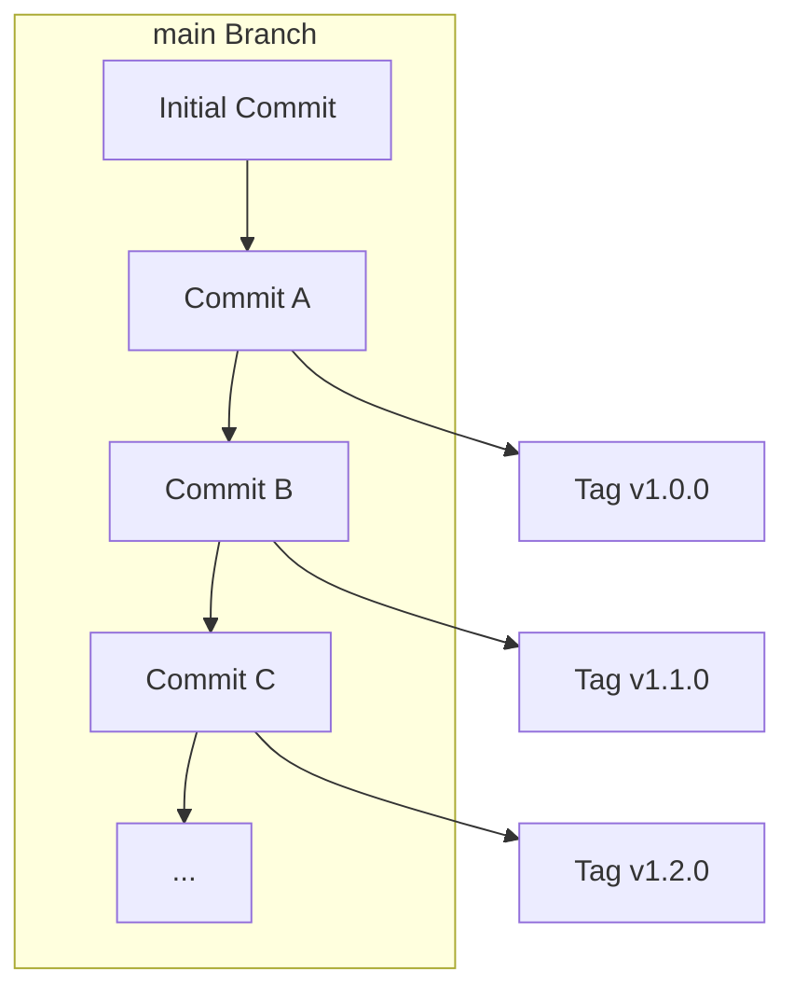

# release-typescript-action [](https://github.com/int128/release-typescript-action/actions/workflows/ts.yaml)

This is an action to automate the release of an action written in TypeScript.


## Problem to solve

Typically we need to commit the generated files (e.g. `dist/index.js`) into main branch,
because GitHub Actions runs it on Node.js.

It causes the following problems:

- Release workflow is complex
- Diff would be large because it contains the generated files
- Commit history would be growth

### Idea

It would be nice to commit the generated files into a release tag only.

This action creates a release tag with the generated files.
For example,



main branch (i.e. Commit A, B and C) does not contain the generated files.
Only a release tag contains it.

### Caveat

We cannot specify a branch in a workflow, such as `uses: org/action@main`. Only tag is available.


## Continuous release workflow

This workflow continuously creates a new release from `main` branch.

```yaml
name: release

on:
  pull_request:
    paths:
      - .github/workflows/release.yaml
  push:
    branches:
      - main
    tags:
      - v*

jobs:
  tag:
    runs-on: ubuntu-latest
    steps:
      - uses: actions/checkout@v2
      - uses: actions/setup-node@v2
        with:
          node-version: 16
          cache: yarn
      - run: yarn
      - run: yarn build
      - run: yarn package
      - uses: int128/release-typescript-action@v1
```

When you merge a pull request into `main` branch, this action will create a new release of new minor version.
For example, if the latest tag `v1.5.0` exists, this action will create a tag `v1.6.0`.
It will also update the major tag `v1` to track the latest tag.


## Daily release workflow

This workflow everyday creates a new release from `main` branch.

```yaml
name: release

on:
  pull_request:
    paths:
      - .github/workflows/release.yaml
  push:
    tags:
      - v*
  schedule:
    - cron: "0 0 * * *"

jobs:
  tag:
    runs-on: ubuntu-latest
    steps:
      - uses: actions/checkout@v2
      - uses: actions/setup-node@v2
        with:
          node-version: 16
          cache: yarn
      - run: yarn
      - run: yarn build
      - run: yarn package
      - uses: int128/release-typescript-action@v1
```

When a schedule is triggered, this action will create a new minor release.
It will also update the major tag `v1` to track the latest tag.

You can create a new release instead of the daily release.
When you push a tag, this action will add a commit with `dist` directory to the tag.

This action ignores any pull request event.


## Specification

This action assumes the following repository layout:

- For polyrepo
  - `.gitignore` contains `/dist`
  - Generated files are under `dist`
  - Action definition is at `action.yaml`
- For monorepo
  - `.gitignore` contains `dist/`
  - Generated files are under `*/dist`
  - Action definitions are at `*/action.yaml`

It creates a new release only if the generated file(s) or action definition is changed.

It ignores any pull request event.


### Inputs

| Name | Default | Description
|------|----------|------------
| `major-version` | `1` | Major version to create a tag
| `token` | `github.token` | GitHub token

If you want to create a new major release, set `major-version` to 2 or greater.
